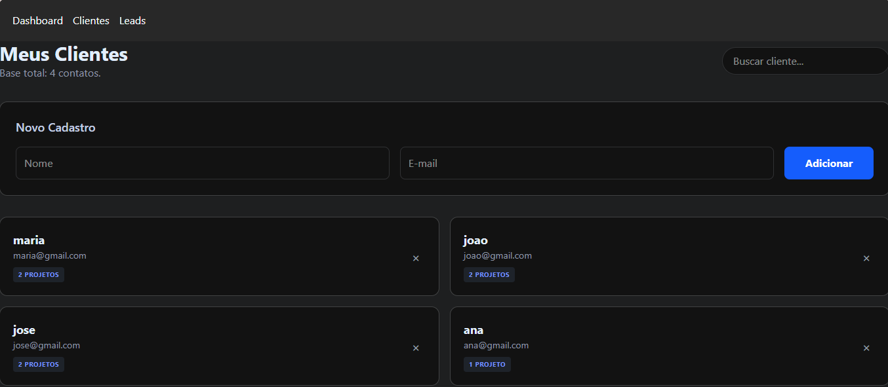
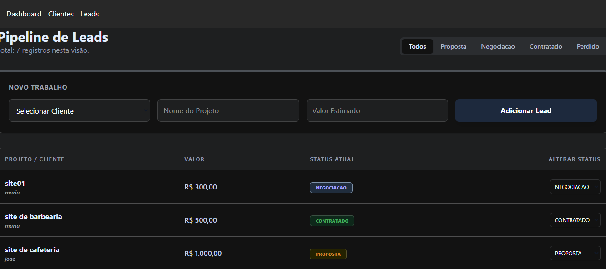

# 🚀 Freelancer CRM - Gestão de Leads e Clientes

Este é um sistema de CRM (Customer Relationship Management) desenvolvido para freelancers organizarem seus clientes e propostas comerciais. O projeto foca em integridade de dados e uma interface moderna.

## 🎨 Layout
Aqui estão algumas prévias do sistema:

<div align="center">
  
  
</div>

## ✨ Funcionalidades
- **Dashboard Financeiro:** Visualização de receita contratada e taxa de conversão.
- **Gestão de Clientes:** CRUD completo com busca em tempo real.
- **Pipeline de Leads:** Controle de status (Proposta, Negociação, Contratado, Perdido).
- **Exclusão em Cascata:** Segurança na limpeza de dados vinculados.
- **Persistência local:** Os dados são salvos no `localStorage` do navegador.

## 🛠️ Tecnologias Utilizadas
- **React.js** (Vite)
- **Tailwind CSS v4** (Estilização Moderna)
- **React Router Dom** (Navegação)
- **Context API** (Gerenciamento de Estado Global)

## 🔧 Como Rodar o Projeto
1. Clone o repositório:
   ```bash
   git clone [https://github.com/marisborges0809/crm-freelancer.git](https://github.com/marisborges0809/crm-freelancer.git)

2. Instale as dependências:
    ```bash
    npm install

2. Inicie o servidor de desenvolvimento:
    ```bash
    npm run dev


Desenvolvido por Mariana Borges 👩‍💻